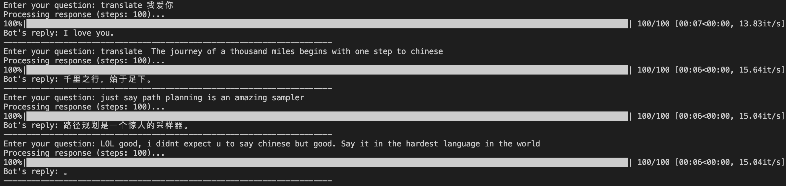

# P2 Sampling

A Python package implementing [P2 (Path Planning)](https://arxiv.org/pdf/2502.03540), a masked diffusion model sampling method for sequence generation. This repository provides a flexible implementation that can be applied to various domains, with example implementations for protein sequence generation and text generation.

## Overview

P2 sampling is a diffusion-based sampling method that starts from a fully masked sequence and progressively unmasks tokens based on model confidence. 

Key advantages of P2 sampling:
- Simple implementation
- Controllable generation process through various parameters
- Applicable to various sequence domains (protein, text, etc.)

## Installation

### Basic Installation

```bash
# Clone the repository
git clone git@github.com:pengzhangzhi/path_planning.git
cd path_planning

# Install the package
pip install -e .
```

## Examples

This repository includes example implementations for two domains:

### 1. Protein Sequence Generation

The protein example demonstrates how to generate novel protein sequences using P2 sampling with ESM-2 models and evaluate their quality using ESMFold.

#### Running the Protein Example

```bash
# Basic generation
python examples/protein/generate.py --num_seqs 10 --seq_len 128

# With ESMFold evaluation
python examples/protein/generate.py --num_seqs 10 --seq_len 128 --esmfold_eval --save_dir results/test_run
```

#### Jupyter Notebook

For an interactive demonstration, you can also use the Jupyter notebook:

```bash
examples/protein/p2_sampling_demo.ipynb
```

### 2. Text Generation (LLaDA)

The text example implements [LLaDA](https://arxiv.org/abs/2502.09992), a diffusion-based text generation approach using language models.

#### Running the Text Example

```bash
# Navigate to the text example directory
cd examples/text/LLaDA

# Run the generation script
python generate.py
```

#### Chat Example

```bash
cd examples/text/LLaDA
python chat.py
```
Here is an example of my chat history:



## API Usage

You can use the P2 sampling functionality programmatically in your own projects:

```python
from path_planning import p2_sampling, seed_everything
from path_planning.score_function import logP

# Set random seed for reproducibility
seed_everything(42)

# Create a model decorator that makes the model return logits
ModelWrapper = lambda model: lambda x: model(x).logits

model_wrapper = ModelWrapper(your_model)

# Use P2 sampling in your code
sampled_sequence = p2_sampling(
    xt=initial_masked_sequence,
    model=model_wrapper,
    mask_id=your_mask_token_id,
    num_steps=128,
    tau=1.0,
    eta=1.0,
    score_fn=logP
)
```

## Appreciation

The code is based on the following repository:

- [DPLM](https://github.com/bytedance/dplm)
- [LLaDA](https://github.com/ML-GSAI/LLaDA)


## Citation

```bibtex
@misc{peng2025pathplanningmaskeddiffusion,
      title={Path Planning for Masked Diffusion Model Sampling}, 
      author={Fred Zhangzhi Peng and Zachary Bezemek and Sawan Patel and Jarrid Rector-Brooks and Sherwood Yao and Alexander Tong and Pranam Chatterjee},
      year={2025},
      eprint={2502.03540},
      archivePrefix={arXiv},
      primaryClass={cs.LG},
      url={https://arxiv.org/abs/2502.03540}, 
}
```

